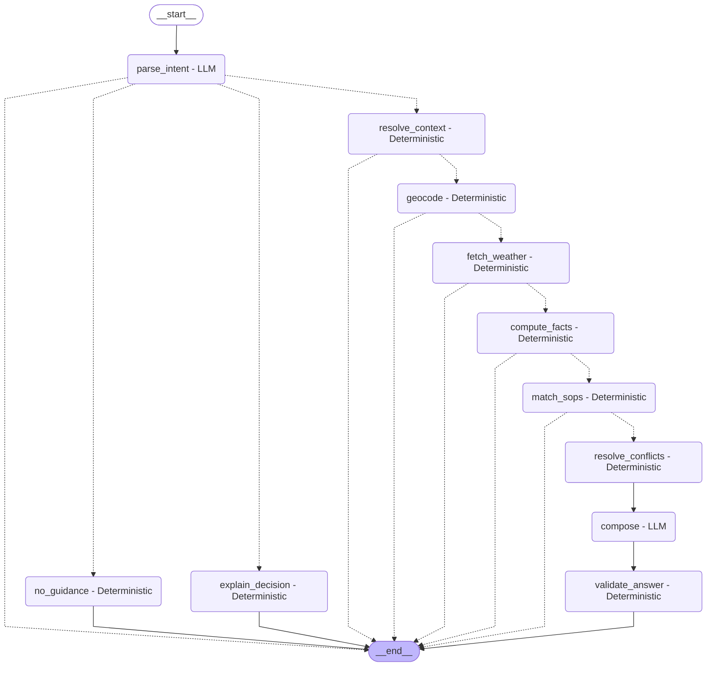

# LangGraph Workflow Architecture

This document visualizes the compiled state machine for the Weather Advisory Support Bot.

## Routing & Node Responsibilities

1. **`parse_intent` (LLM)**: Extracts location, activity tags (restricted to derived vocabulary), and time reference from untrusted user query.
2. **`no_guidance` (Deterministic)**: Emits a polite out-of-scope response.
3. **`explain_decision` (Deterministic)**: Answers "why did you say that?" from session audit log (`decision_log`).
4. **`resolve_context` (Deterministic)**: Reuses prior session location/activity if omitted in follow-ups; defaults missing time to `today`.
5. **`geocode` (Deterministic)**: Resolves coordinates via Open-Meteo Geocoding API; routes to `format_error` on failure.
6. **`fetch_weather` (Deterministic)**: Fetches fresh live metrics; routes to `format_error` on network/API failure.
7. **`compute_facts` (Deterministic)**: Aggregates facts for local time window; routes to `window_passed` if window elapsed.
8. **`match_sops` (Deterministic)**: Evaluates SOP conditions with 3-valued logic; routes to `data_incomplete` or `no_guidance` if 0 match.
9. **`resolve_conflicts` (Deterministic)**: Resolves primary advisory via strict precedence (override $\to$ severity $\to$ priority $\to$ id).
10. **`compose` (LLM)**: Drafts human response from structured advice only (receives zero raw user input). Falls back to `templated_answer` on error.
11. **`validate_answer` (Deterministic)**: Verifies numbers and SOP IDs against allow-list; appends code-generated citation footer. Falls back to `templated_answer` if validation fails.
